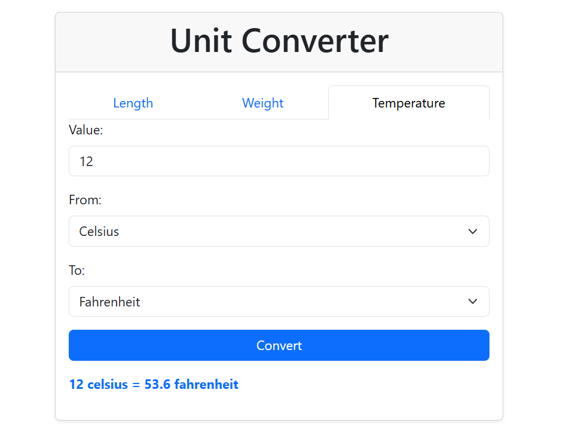

# 🌐 Unit Converter App

Convert between different units of measurement with ease!  
This project is inspired by the [roadmap.sh Unit Converter project](https://roadmap.sh/projects/unit-converter) 🚀

## ✨ Features

- 🔢 **Convert** between Length, Weight, and Temperature units
- 🖥️ **Modern web UI** with tabs for each measurement type
- ⚡ **Instant results** via a Spring Boot backend API
- 🔄 **No database required** – all logic is in code!
- 📦 **Full-stack**: Java Spring Boot (backend) + HTML/CSS/JS (frontend)


## 🖼️ Screenshot


## 🧮 Supported Units

### Length
- Millimeter, Centimeter, Meter, Kilometer, Inch, Foot, Yard, Mile

### Weight
- Milligram, Gram, Kilogram, Ounce, Pound

### Temperature
- Celsius, Fahrenheit, Kelvin

## 🚀 Quick Start

1. **Clone the repo**
   ```bash
   git clone https://github.com/yourusername/your-repo.git
   cd your-repo
   ```

2. **Run the backend**
   ```bash
   cd backend
   ./mvnw spring-boot:run
   ```
   (or use `mvn spring-boot:run` if you have Maven installed)

3. **Open the frontend**
   ```bash
   cd ../frontend
   # Open index.html in your browser or use Live Server
   ```

4. **Convert units and enjoy!**


## 🤝 Contributing

Pull requests and suggestions are welcome!  
Feel free to fork and improve this project.
